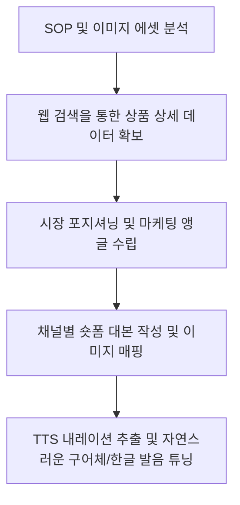

# 작업 기록: 토스쇼핑 쉐어링크 부수입 숏폼 기획 (랜선식당 연탄불고기)

본 문서는 **[토스쇼핑_쉐어링크_부수입_AI작업지시서.md](file:///d:/AI_SONS/short_form/%ED%86%A0%EC%8A%A4%EC%87%BC%ED%95%91_%EC%89%90%EC%96%B4%EB%A7%81%ED%81%AC_%EB%B6%80%EC%88%98%EC%9E%85_%EC%9EC%9E%91%EC%97%85%EC%A7%80%EC%8B%9C%EC%84%9C.md)**를 기반으로 진행한 **‘랜선식당 을지로 연탄불고기’** 상품의 마케팅 전략 분석, 숏폼 대본 기획, 그리고 TTS 내레이션 제작 과정과 결과물을 기록한 파일입니다. 추후 유사한 상품의 쉐어링크 부수입 프로젝트를 진행할 때 가이드라인으로 활용할 수 있습니다.

---

## 1. 프로젝트 개요

*   **진행 일자**: 2026년 7월 30일
*   **대상 상품**: 랜선식당 을지로 연탄불고기 (250g x 4팩 구성, 핫딜가 8,300원, 무료배송)
*   **작업 목적**: 얼굴 노출 없는 숏폼 영상(슬라이드/움짤 + TTS) 제작을 위한 이커머스 분석 및 채널별 대본/내레이션 원본 확보
*   **활용 에셋**: [pic](file:///d:/AI_SONS/short_form/pic) 폴더 내 이미지 에셋 10장 (`연탄불고기 (1).png` ~ `연탄불고기 (10).png`)

---

## 2. 작업 진행 프로세스

### [Step 1] 기획 지시서 및 에셋 검토
*   `토스쇼핑_쉐어링크_부수입_AI작업지시서.md` 가이드에 따라 '노페이스(No-Face)' 제작 스펙 확인.
*   [pic](file:///d:/AI_SONS/short_form/pic) 폴더 내부 이미지 10장의 특징과 텍스트 정보를 사전 분석하여 적재적소에 매핑할 계획 수립.

### [Step 2] 상품 데이터 및 경쟁력 분석
*   **검색 데이터**: 핫딜 가격(8,300원, 무료배송), 1팩당 2,075원의 압도적 가성비 확인.
*   **USP(핵심 경쟁력)**: A급 목전지 사용(원육 80%), 30시간 저온 숙성 특제 불향 소스, 5단계에서 2단계로 유통마진 혁신, 스마트 HACCP 위생 인증, 100만 팩 및 10차 완판 기록.

### [Step 3] 채널별 숏폼 대본 작성
*   **인스타그램 릴스 (25초)**: 자취생/1인가구의 지출 절감 욕구(배달비 저격) 및 침샘 자극 앵글.
*   **유튜브 쇼츠 (40초)**: 유통 거품 제거 원리와 팩트 중심의 신뢰감 제공 앵글.
*   **틱톡 (17초)**: 젊은 층 타겟의 초고속 요약 및 도파민/비트 중심 앵글.

### [Step 4] TTS 내레이션 추출 및 튜닝 (핵심 피드백 반영)
*   대본 본문에서 음성 합성(TTS)으로 들어갈 대사만 추출하여 개별 텍스트 파일로 생성.
*   TTS 리더기가 숫자가 기호를 자연스럽게 읽을 수 있도록 **한글 발음 표기법**으로 변환 적용 (예: `80%` $\rightarrow$ `팔십프로`, `10차` $\rightarrow$ `십차`, `8,300원` $\rightarrow$ `팔천삼백원`, `스마트 HACCP` $\rightarrow$ `스마트 해썹`).

---

## 3. 주요 산출물 링크 및 내용

### 3-1. TTS 내레이션 텍스트 파일
*   **인스타그램 릴스용**: [reels_tts.txt](file:///d:/AI_SONS/short_form/reels_tts.txt)
    > "아직도 배달 불고기 만오천원 주고 시켜 드시나요? 이거 한 팩에 단돈 이천원입니다..."
*   **유튜브 쇼츠용**: [shorts_tts.txt](file:///d:/AI_SONS/short_form/shorts_tts.txt)
    > "행사만 열리면 순식간에 품절 대란 난다는 이 고기, 대체 정체가 뭘까요?..."
*   **틱톡용**: [tiktok_tts.txt](file:///d:/AI_SONS/short_form/tiktok_tts.txt)
    > "올리자마자 품절 대란 터진 이천원짜리 불고기!..."

### 3-2. 비디오 씬별 이미지 에셋 매핑 가이드

| 씬 분류 | 시각 자료 매핑 | 핵심 메시지 |
| :--- | :--- | :--- |
| **Hook (도입부)** | [pic/연탄불고기 (5).png](file:///d:/AI_SONS/short_form/pic/%EC%95%ED%83%84%EB%B6%88%EA%B3%A0%EA%B8%B0%20%285%29.png) (가격비교 차트) [pic/연탄불고기 (2).png](file:///d:/AI_SONS/short_form/pic/%EC%95%ED%83%84%EB%B6%88%EA%B3%A0%EA%B8%B0%20%282%29.png) (품절 대란) [pic/연탄불고기 (3).png](file:///d:/AI_SONS/short_form/pic/%EC%95%ED%83%84%EB%B6%88%EA%B3%A0%EA%B8%B0%20%283%29.png) (완판 카드 그리드) | 기존 고비용 배달 음식의 대안으로 포지셔닝하여 시청 지속시간 확보 |
| **Body (특장점)** | [pic/연탄불고기 (6).png](file:///d:/AI_SONS/short_form/pic/%EC%95%ED%83%84%EB%B6%88%EA%B3%A0%EA%B8%B0%20%286%29.png), [(7).png](file:///d:/AI_SONS/short_form/pic/%EC%95%ED%83%84%EB%B6%88%EA%B3%A0%EA%B8%B0%20%287%29.png) (유통 축소) [pic/연탄불고기 (8).png](file:///d:/AI_SONS/short_form/pic/%EC%95%ED%83%84%EB%B6%88%EA%B3%A0%EA%B8%B0%20%288%29.png) (원육 스펙) [pic/연탄불고기 (9).png](file:///d:/AI_SONS/short_form/pic/%EC%95%ED%83%84%EB%B6%88%EA%B3%A0%EA%B8%B0%20%289%29.png) (저온숙성 & 조리) [pic/연탄불고기 (10).png](file:///d:/AI_SONS/short_form/pic/%EC%95%ED%83%84%EB%B6%88%EA%B3%A0%EA%B8%B0%20%2810%29.png) (위생) | 초저가임에도 높은 품질(A급, 숙성 소스)과 위생(HACCP)을 갖추었음을 입증 |
| **CTA (전환 유도)** | [pic/연탄불고기 (1).png](file:///d:/AI_SONS/short_form/pic/%EC%95%ED%83%84%EB%B6%88%EA%B3%A0%EA%B8%B0%20%281%29.png) (조리 완료 컷) [pic/연탄불고기 (4).png](file:///d:/AI_SONS/short_form/pic/%EC%95%ED%83%84%EB%B6%88%EA%B3%A0%EA%B8%B0%20%284%29.png) (특가 소구) | 무료배송 가격 수치 소구 및 즉각적인 프로필 링크/고정 댓글 클릭 유도 |

---

## 4. 향후 참고할 핵심 꿀팁 및 Lessons Learned

> [!TIP]
> **1. TTS 리스크 방지를 위한 발음 중심 표기 변환**
> *   기성 TTS 엔진(타입캐스트, 클로바더빙 등)은 숫자가 기호(`%`, `HACCP`, `8,300원`)를 읽을 때 종종 어색한 억양이나 영어 철자 그대로(`에이치에이씨씨피`) 읽는 오류가 발생합니다.
> *   반드시 스크립트 작성 단계에서 숫자는 **한글 수사 및 단위(만오천원, 팔천삼백원, 삼십시간)**로, 영문 약어는 **한글 외래어 표기(해썹인증)**로 텍스트 가공을 마쳐야 무검수 자동 송출 시 사고를 방지할 수 있습니다.

> [!IMPORTANT]
> **2. 법적 표시광고법 상시 노출 의무**
> *   토스 쉐어링크 및 쿠팡 파트너스는 단기적인 클릭에 기반하므로 소비자가 인지하기 쉬운 위치에 경제적 대가 문구를 넣어야 합니다.
> *   **자막 배치**: 동영상 파일 인코딩 시 영상 첫머리부터 끝까지 상시 노출되는 반투명 배너 자막(`광고 | 수수료 지급`)을 기본 템플릿화하여 적용하는 것이 안전합니다.

> [!NOTE]
> **3. 고가 배달 음식과의 강한 대비 효과**
> *   푸드 밀키트 카테고리는 단순히 맛있어 보인다는 정보만으로는 전환율이 낮습니다.
> *   시청자가 평소에 시켜 먹는 **배달 음식 영수증 가격**을 도입부에 보여줌으로써 즉각적인 비용 절감 혜택(Pain Point 해결)을 각인시키는 구조가 가장 효과적입니다.
